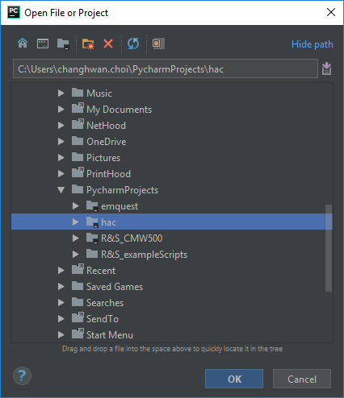

# EMQuest Data Conversion Program (For Frequency Response Data)
This project was built to automate the conversion and organization of frequency response data outputs from the EMQuest system, compiling all the data into a single '.xlsx' Excel file.

Thsi project was developed in Python 3.6.

## Getting Started
### Overview
#### Programs
* [Anaconda3/Miniconda3]( https://www.anaconda.com/download/)
    * Python projects often implement a variety of different third party libraries which, as projects scale up, can be hard to manage in an organized fashion. As a Python distribution, Anaconda provides the core Python language, hundreds of core packages, a variety of different development tools (e.g. IDEs), and **conda**, Anaconda’s package manager that facilitates the downloading and management of Python packages.
* [Python 3.6]( https://www.python.org/downloads/) (included in Anaconda3/Miniconda3)
    * Python is the main programming language for this project. It has an active open-source community and easily readable code syntax, making Python a great language of choice for projects like these. 
*	An Integrated Development Environment (IDE) supporting Python – [PyCharm]( https://www.jetbrains.com/pycharm/download/) is recommended.
    * While PyCharm is not necessary to run this program, we highly recommend it for Python-based development. It is easy to integrate it with Anaconda and provides fantastic tools/shortcuts/hotkeys that make development faster and easier.

#### Packages:
The following packages are required to run the program (are either included with the Anaconda installation or may be installed through Anaconda):
- openpyxl
- NumPy
- Pandas
- WxPython

### Installation:
1.	First, install [Anaconda3/Miniconda3]( https://www.anaconda.com/download/), which comes with the latest stable version of Python (3.6 at the time of writing this README) included. Choose the appropriate installation for your respective operating system.
2.	Install [PyCharm]( https://www.jetbrains.com/pycharm/download/) or any other IDE that supports Python.

*Note: the following steps will show how to set up the environment using Anaconda and PyCharm, but the project is not restricted to these tools exclusively.*

3.	We will now install the different packages required to run the scripts.
  * Open **Anaconda Navigator** and click on **Environments** tab on the left.
  
   
  
  * Select **Not installed** from the dropdown menu.
  
  
  
  * From here, we can search for each of the different packages listed above (in the Packages subsection of the Overview). To download the packages, check the box next to the package and click **Apply** at the bottom. Keep in mind that some of these packages may already have come with the full Anaconda installation.
  * Some packages may not be found using the Navigator. In this case, they must be downloaded using **Anaconda Prompt**. Open the prompt and type the following: `conda install -c anaconda <package_names_space-separated>`.
  
  

*Note: Alternatively, you can add the packages in the **Project Interpreter** section of the project settings in PyCharm. However, this must be done after the project has been opened and the project interpreter has been selected, which will be done in the next few steps.*

4.	Open PyCharm and open the project – select the **hac** folder in the “Open File or Project” window.

  
  
5.	Select **File->Settings…** and select the **Project Interpreter** tab on the left. Click on the cog and select **Add…**.
  
  
  
  * Click on the **System Interpreter** tab on the left and select the location of the python.exe file from your Anaconda/Miniconda installation (most probably found in `C:\Users\<user>\AppData\Local\Continuum\anaconda3\python.exe`).

## Deployment
Open `emquest/venv/main.py` and click run (green play button at the top right of PyCharm). To run from the command line, open the Anaconda Prompt, navigate to `emquest/venv` directory and enter:
```bash
python main.py
```
Alternatively, you can run the program directly from the Windows command line, but you must first add Python to the PATH varaibles of the system. Follow the steps [here](https://superuser.com/questions/143119/how-to-add-python-to-the-windows-path).

A basic GUI will appear with a preset template file already loaded.

[TODO: Add image]

### Managing the files to be converted
The program is capable of handling multiple input files at once, creating separate output files for each LTE band (whilst compiling all data from the same LTE band into their respective output files). The input files should be in '.csv' format and loaded onto cells in the **Selected Output Files to Convert** section. This can be done by pressing the **Add** button at the bottom of the file list section.

### Selecting the save directory
All of the conversion's output files ('.xlsx' Excel sheets) are saved in the same directory, specified in the **Save Directory** text line. Note that, regardless of the number of input files, all data will be compiled into their respective bands' output files, and all of these output files will be stored the selected save directory.

### Selecting the template file
The teplate file should come preselected, but in case that it is not, you can load the file by pressing **Find Template File...** on the left. We recommend not moving the `EMQuest conversion Rev A.xlsx` from its location in the repo/project directories.

### Converting/Compiling the input files
To begin the conversion, click on the **Run** button at the bottom right of the GUI. If the **Enable Checkpoints** checkbox has been enabled, the program will ask if you want to check the output file before proceeding with the rest of the file conversions.

### Shortcut Keys
The program has a few shortcuts to accelerate program workflow.

`Ctrl + A` - Add input files to the list of files to convert

`Ctrl + B` - Clear the input files list

`Ctrl + S` - Select save directory

`Ctrl + T` - Select template file

`Ctrl + R` - Run conversion script

## In-Depth Algorithm Description
The conversion process begins by taking a raw input file from the list of files to convert. The program determines what LTE band the file's data corresponds to, and checks if the output file already exists in the save directory specified. If it does not exist, the program makes a copy of the template file for the LTE band at hand. Otherwise, it prepares to place the data in its corresponding output file.

The program then confirms is the file is of the right format (i.e. received straight from EMQuest without tampering of data/formatting). The frequency response values are extracted into a Pandas DataFrame. The code then determines where in the output sheet the data should be pasted.

This is then repeated for all files in the list. At the end, the GUI opens a dialog window that shows which files have been converted successfully and which ones had issues (e.g. corrupt files, wrong file format, invalid number of data points, etc.).

## Running the Tests
[TODO: Add tests]
## Integration Tests

## Unit Tests

## Built With
- [openpyxl](https://openpyxl.readthedocs.io/en/stable/)
- [NumPy](http://www.numpy.org/)
- [Pandas](https://pandas.pydata.org/)
- [wxPython](https://wxpython.org/)

## Contributing
[TODO: Add Contributions section]

## Authors
- Chang Hwan 'Oliver' Choi - *Biomedical Engineering Intern* - [changhwan95](https://github.com/changhwan95)

Originally developed for the internal use of PCTEST Engineering Labs, Inc. (SAR Department)

## License
[TODO: Add all lincenses]

## Acknowledgements
- Rachel Rigg
- PCTEST Engineering Labs, Inc.
- Billie Thompson ([PurpleBooth](https://gist.github.com/PurpleBooth)) for the README template
